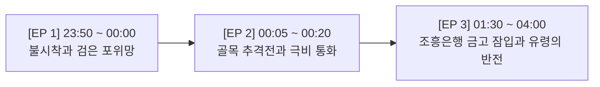

# 🏛️ KAIRA AI 가상 영화사 1997 IMF 3부작 마스터 스토리 바이블

> **제정 일자**: 2026-09-16  
> **총괄 책임**: 최고사령관(오빠) & 부회장(제나)  
> **핵심 철학**: 즉흥적 컷 나열 영구 배제, 1~3화 시간·공간·소품·인물 인과관계 100% 무결점 연속성 엄수.

---

## 🎬 1. 3부작 전체 타임라인 및 서사 연결 구조

---

## 📜 2. 에피소드별 정밀 서사 & 씬 구성 (연속성 헌법)

### [EP 01 : 불시착과 검은 포위망 (23:50 ~ 00:00)] — *기(起)*
* **시간/배경**: 1997년 11월 20일 밤 23시 50분, 비 내리는 서울 명동 거리.
* **등장인물**: 뉴라 (NEURA), 검은 양복 요원들(실루엣).
* **사건 전개**:
  1. 2026년 미래에서 1997년 비 내리는 명동 아스팔트로 불시착한 뉴라 (우산 없음, 샴페인 골드 드레스 위 블랙 트렌치코트 착용).
  2. 기지국이 없어 '서비스 없음'이 뜬 스마트폰 캐시 화면에 '9시간 뒤 국가부도 선언' 미래 속보가 뜸.
  3. 자정(00:00) 정각, 빗속 저 멀리서 검은 우산을 든 정체불명의 검은 양복 요원들(해외 투기자본 세력)이 뉴라를 포위해 옴.
* **엔딩 클리프행어**: *"그들이 움직이기 시작했습니다. 남은 시간은 단 9시간... 이 모든 것은 이미 조작되었습니다."*

---

### [EP 02 : 골목 추격전과 극비 통화 (00:05 ~ 00:20)] — *승(承)* 👈 **[현재 정밀 제작 대상]**
* **시간/배경**: 1997년 11월 21일 00시 05분 ~ 00시 20분, 명동 빗속 골목길 및 한국통신 은색 공중전화 부스.
* **등장인물**: 뉴라, 검은 양복 추격자들, 조흥은행 내부 조력자 (박 과장, 목소리).
* **사건 전개 & 4대 컷 구성**:
  1. **컷 01 (시계탑 로우앵글)**: 우산 없이 쏟아지는 비를 온몸으로 맞으며, 멈춰버린 조흥은행 00:00 시계탑을 올려다보는 뉴라.
  2. **컷 02 (골목 질주 추격전)**: 뒤돌아본 순간, 빗속을 뚫고 쫓아오는 검은 양복 요원들을 발견하고 빗물 튀기며 골목으로 전력 질주하는 뉴라!
  3. **컷 03 (은색 부스 은신 & 폰 접사)**: 골목 모퉁이 1997 한국통신 은색 메탈 공중전화 부스로 뛰어들어 문을 닫고, 창밖을 경계하며 켜는 배터리 1% 스마트폰 화면 접사.
  4. **컷 04 (조력자 극비 통화 POV)**: 은색 전화기에서 실버 수화기를 들고 조흥은행 국제금융부 내부 조력자 박 과장에게 다급하게 외침.
     - 🗣️ *"박 과장님, 놈들이 움직였어요. 지금 당장 지하 금고 락을 걸고 모든 원화를 달러로 묶으세요!"*
* **엔딩 클리프행어**: 전화기 너머로 들려오는 거친 침입 소리와 끊기는 신호음(뚜- 뚜-). 꺼져버린 스마트폰. 뉴라의 서늘한 결의: *"내가 직접 들어간다."*

---

### [EP 03 : 조흥은행 금고 잠입과 유령의 반전 (01:30 ~ 04:00)] — *전·결(轉·結)*
* **시간/배경**: 1997년 11월 21일 새벽 02시, 조흥은행 본점 지하 대형 금고실 ➡️ 명동 새벽 안개 골목.
* **등장인물**: 뉴라, 재정경제원 특별조사반 요원들.
* **사건 전개**:
  1. 연락이 끊긴 조력자를 구하고 국부를 지키기 위해, 새벽 2시 삼엄한 경비를 뚫고 조흥은행 지하 대형 금고실로 단독 잠입하는 뉴라.
  2. 부패 세력이 밀반출하려던 핵심 외환(달러)을 선제 회수하여 안전지대로 이체/격리하고, 텅 빈 금고 바닥 장부에 피 같은 붉은 서명 `NEURA`를 남김.
  3. 아침 6시, 국가 부도 선언과 함께 들이닥친 정부 특별조사반이 텅 빈 금고와 서명을 보고 경악.
  4. 가죽 가방을 들고 명동 새벽 안개 속으로 사라지는 뉴라의 트렌치코트 뒷모습.
* **엔딩 떡밥 (현실 무한루프)**: *"당신 지갑 속 100달러 지폐의 일련번호를 확인하세요. 그날 밤, 유령이 남긴 미래의 비밀일지 모릅니다."*

---

## 🏛️ 3. 씬별 필수 소품 & 비주얼 앵커 헌법

1. **날씨 & 의상 인과관계**:
   - 1화 불시착부터 2화 추격전까지 **우산은 절대 없음**!
   - 빗물에 젖은 흑발 롱웨이브, 샴페인 골드 실크 슬립 드레스(V넥), 젖은 블랙 롱 트렌치코트.
2. **공중전화 부스 고증**:
   - 빨간색 서양 부스 영구 금지!
   - **1997 한국통신(KT) 은색 알루미늄/스테인리스 프레임 + 대형 통유리벽 + 상단 파란색 [공중전화] 마크**.
3. **공중전화기 및 수화기**:
   - 검은 플라스틱 전화기 금지!
   - **실버 메탈릭 버튼식 공중전화기 본체 + 실버 메탈릭 수화기 + 본체 하단 U자형 유선 코드**.
4. **추격자 비주얼**:
   - 1997년식 블랙 오버핏 싱글 수트, 검은 우산, 빗속 어둠 속에서 서서히 다가오는 위협적 실루엣.
