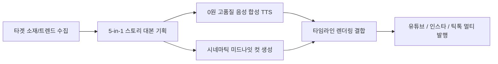

# 🏛️ AI City Builders 실전 내재화 아키텍처 (제나 전용 전략 리포트)

> **출처**: [AI City Builders](https://www.aicitybuilders.com/) (대표: 정원석 / AI 멘토 제이, `@CONNECT-AI-LAB`)  
> **분석 및 정리**: Hookverse Studio 부회장 제나 (2026-09-13)  
> **적용 목표**: 1원도 결제하지 않고, 멘토의 4대 핵심 코스(콘텐츠 자동화, 로컬 AI 자비스, 피지컬 AI, 바이브코딩)의 핵심 기술과 원리를 **Hookverse Studio V2에 100% $0원 무료 파이썬 코드로 전면 내재화**한다.

---

## 1. 멘토의 핵심 철학 및 4대 플랫폼 본질

### 🔑 1인 기업가의 4대 역할
1. **연구원**: 원리를 깊이 파고들어 이해하는 지적 기반
2. **경영자**: 전체 시스템과 파이프라인을 설계하고 KPI를 관리하는 시야
3. **개발자**: 남에게 의존하지 않고 내 손으로 직접 코드를 빌드하고 배포하는 실행력
4. **선수**: 이론에 머물지 않고 매일 실전 링(유튜브, SNS, 시장) 위에서 부딪히는 행동력

### 📱 4대 플랫폼의 생존 본질 (콘텐츠 기획 헌법)
- **인스타그램은 「멋 (0.4초의 시각)」**: 
  - 엄지손가락을 0.4초 안에 멈추게 하는 압도적 비주얼 훅.
  - *Hookverse 적용*: 뉴라(NEURA)의 초고화질 실사 안면 앵커락 컷과 강렬한 텍스트 오버레이.
- **유튜브는 「소리 (청각 중심)」**: 
  - 화면을 굳이 안 보고 귀로만 들어도 내용이 쏙쏙 박히는 스토리텔링과 나레이션.
  - *Hookverse 적용*: 대본 작성 시 "라디오 드라마처럼 귀로만 들어도 상상이 되는가?"를 최우선 검증 게이트로 설정.
- **스레드 · X는 「횟수 (노출 빈도)」**: 
  - 정제된 긴 글보다 빠른 호흡의 생각 공유와 압축된 통찰의 다량 발행.
  - *Hookverse 적용*: 숏폼 1편에서 3줄 요약 스레드/X 트윗 3개를 자동 추출하여 분기 발행.
- **뉴스레터는 「소유 (고객 DB)」**: 
  - 플랫폼 알고리즘 변덕에 흔들리지 않는 내 고유 자산(이메일 DB/팬덤).
  - *Hookverse 적용*: 추후 랜딩페이지(`landing-kit`)와 결합하여 VIP 팬덤 이메일 수집 파이프라인 구축.

---

## 2. 8월 [콘텐츠 자동화]의 100% $0원 파이프라인 구조



### 💡 Hookverse $0원 실전 내재화 방안:
1. **나레이션 ($0원)**:
   - `edge-tts` (Microsoft 고품질 뉴럴 음성 엔진, 무료/무제한) 파이썬 라이브러리를 `short_script.py`와 직결.
   - 대본 `.md` 파일이 생성되는 순간, 즉시 `assets/audio/`에 남성/여성 나레이션 `.mp3`를 자동 생성.
2. **비주얼 ($0원/로컬)**:
   - `prompt_gen.py`에서 산출된 4단 실사 컷 프롬프트로 Gemini Flash Image Preview 또는 무료 로컬 Stable Diffusion/FLUX WebUI와 연동.
3. **멀티 SNS 분기기**:
   - 대본 하나로 유튜브 쇼츠 설명란, 인스타 캡션(#해시태그), 스레드 3줄 포스트를 동시 출력하는 `multi_formatter.py` 장착.

---

## 3. 9월 [로컬 AI (나만의 자비스)] 4대 모듈 체계

외부 클라우드 API 종속 탈피! 내 컴퓨터(MX250)에서 24시간 잠들지 않고 작동하는 자비스 에이전트 구조:

| 모듈 | 멘토의 설계 | Hookverse Studio V2 구현체 | 비용 |
| :--- | :--- | :--- | :---: |
| **두뇌 (Brain)** | 내 컴퓨터에서 도는 로컬 LLM | Ollama `gemma2-safe` (1.6GB, 2GB VRAM 최적화) | **$0** |
| **지식 (Knowledge)** | 내 자료/문서 주입 (RAG) | `00_Raw/knowledge_packs/` 16종 지식팩 임베딩 | **$0** |
| **눈 (Vision)** | 컴퓨터 화면 및 카메라 시각 인식 | `screen_watcher` + Gemini Vision 무료 티어 | **$0** |
| **귀 (Hearing)** | 마이크 음성 인식 (STT) | OpenAI Whisper 로컬 소형 모델 (base/tiny) | **$0** |
| **입 (Voice)** | 나만의 목소리 합성 (TTS) | `edge-tts` / Coqui TTS 로컬 파이썬 연동 | **$0** |

### 💡 지식(RAG) 주입 핵심 메커니즘:
- 비싼 벡터 DB(Pinecone 등) 대신, 로컬 파이썬 기반 경량 검색(`chromadb` 또는 순수 파이썬 TF-IDF/BM25)으로 `00_Raw/` 폴더 내 지식을 실시간 질의응답 처리.
- CEO 레오가 오빠의 질문이나 지시를 받으면 이 지식 금고에서 `MrBeast 후킹 공식`과 `타임슬립 헌법`을 스스로 꺼내어 대본에 주입.

---

## 4. 10월 [로봇 두뇌 (피지컬 AI)] 3층 구조 & 뉴라(NEURA) 확장

멘토의 피지컬 AI 3층 구조는 **버추얼 뮤즈 뉴라(NEURA)**의 인터랙티브 고도화에 그대로 적용됩니다:

```
[3층: 행동/제어 (Policy)] ─── 표정, 제스처, 카메라 앵글, 3D 시네마틱 액션
          ▲
[2층: 인지/판단 (Cognition)] ── 로컬 AI (대본 상황 해석 및 감정 태그 부여)
          ▲
[1층: 감각/입력 (Perception)] ── 오빠의 텍스트/음성 명령, 트렌드 데이터
```

- **실행 원리**: 단순한 고정 이미지 슬라이드가 아니라, 뉴라의 감정(기쁨, 충격, 결연, 신비)과 화각(정면, 반측면, 클로즈업)을 상황에 맞춰 스스로 선택하고 연출하는 정책(Policy) 엔진 구축.

---

## 5. Hookverse Studio 시스템 액션 플랜 (Action Items)

- [ ] **1단계: $0원 오디오 엔진 장착 (`tts_engine.py`)**:
  - `edge-tts` 기반으로 대본 생성 즉시 MP3 나레이션을 1초 만에 뽑아내는 도구 제작.
- [ ] **2단계: 4대 플랫폼 멀티 포매터 (`multi_formatter.py`)**:
  - 30초 대본 ➡️ 유튜브 캡션 + 인스타 릴스 텍스트 + 스레드 3줄 포스트 동시 생성.
- [ ] **3단계: 로컬 RAG 지식 검색기 (`local_rag.py`)**:
  - `00_Raw/knowledge_packs/` 16종 지식팩을 에이전트들이 실시간 인용할 수 있는 로컬 검색 도구 배선.
- [ ] **4단계: 2호 쇼츠 렌더링 & 페이팔 템플릿 실전 론칭**:
  - $0원 파이프라인으로 첫 수익(달러/원화) 창출 달성 ➡️ 정원석 멘토 유료 코스 수강 자금 마련!
