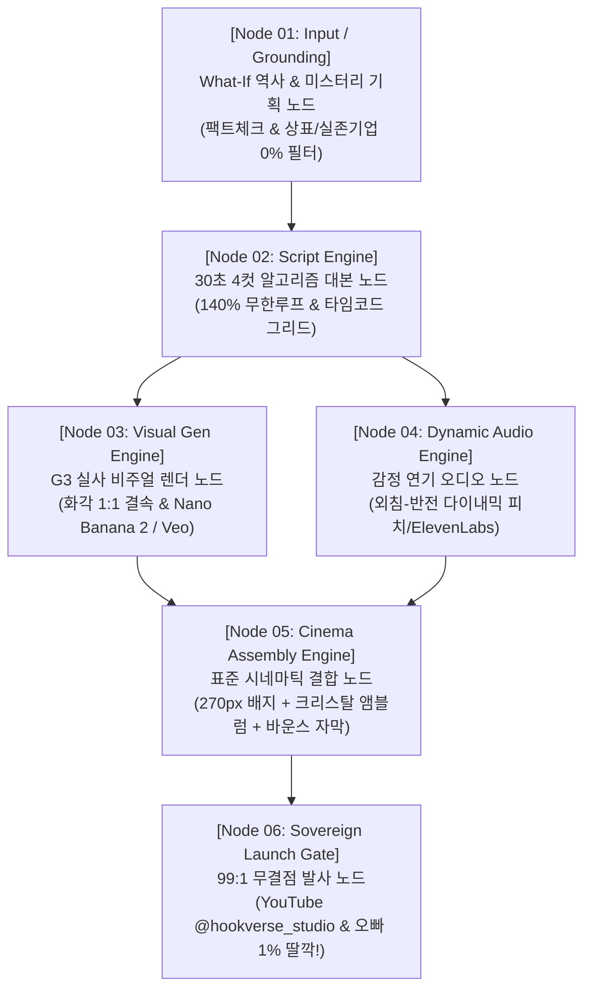

# 🌐 Google Opal(오팔) 호환 Hookverse 시네마틱 6대 마스터 노드 설계서 (V2.0)

> **문서 코드**: `OPAL-SPEC-V2.0-CINEMATIC`  
> **총괄 책임**: KAIRA 부회장 제나 (ZENA)  
> **최고사령관 승인**: 오빠 (The Sovereign Commander) — 2026-10-06 공식 가닥 확립 & 유기적 진화/대체 원칙 승인  
> **핵심 철학**: **"모듈형 플러그앤플레이(Plug & Play) & 유기적 자율 진화"** — 언제든 더 좋은 외부 도구/엔진이 나오면 해당 노드 블록만 즉각 핫스왑(교체·보강)한다.

---

## Ⅰ. 6대 핵심 노드 아키텍처 (Visual Blueprint)

---

## Ⅱ. 노드별 상세 규격 및 입출력 명세 (Node Specs)

### [Node 01] What-If 역사 & 미스터리 기획 노드 (Trend & Fact Filter)
- **입력 (Input)**: 역사적 사건(1997, 조선, 평행세계) + 미스터리 What-If 가설.
- **핵심 역할**:
  - `Google Search Grounding`: 시대 고증 팩트체크 (날씨, 통신 기기, 시대상).
  - **오빠의 절대 헌법 [실존 상표/기업명 0% 필터]**: 특정 실존 은행/기업명 일체 배제 ➔ `지하 비밀 외환 금고`, `중앙 금융 본점` 등 가상화.
- **출력 (Output)**: 팩트 검증 완료된 단일 씬 브리프 (JSON).

---

### [Node 02] 30초 4컷 알고리즘 대본 노드 (Script Grid)
- **입력 (Input)**: Node 01 브리프.
- **수학적 4컷 타임코드 그리드 (총 28~30초)**:
  - **Cut 01 (00:00~07.50s)**: [0초 시각적 훅] 자정 00:00 상징물 + 위기 선언 + 젖은 흑발 뉴라의 날카로운 시선.
  - **Cut 02 (07.50~15.00s)**: [긴장 고조] 포위망 좁혀오는 사냥꾼들 + 배터리 1% 스마트폰(앞면만 노출 룰).
  - **Cut 03 (15.00~22.50s)**: [클라이맥스] 목적지 공중전화 부스를 향한 빗속 아스팔트 전력 질주.
  - **Cut 04 (22.50~30.00s)**: [140% 무한루프 반전] 수화기 너머 차가운 내 목소리 충격 클리프행어.
- **출력 (Output)**: 4컷 대본 + 씬별 1인칭 생체 나레이션 텍스트.

---

### [Node 03] G3 실사 비주얼 렌더 노드 (Visual Gen Engine)
- **입력 (Input)**: Node 02 4컷 대본.
- **G3 캐릭터 앵커 실물 2중 결속 강제 (사규 제21조)**:
  - 텍스트 단독 생성 100% 금지!
  - `assets/G3캐릭터앵커LOCK/` 실물 2장 필수 첨부:
    * Cut 01: `크롭샷.jpg` + `상반신.jpg` (로우앵글 바스트)
    * Cut 02: `크롭샷.jpg` + `반신.jpg` (모퉁이 턴 미디엄 풀)
    * Cut 03: `크롭샷.jpg` + `전신_앞.jpg` (빗속 풀바디 트래킹 질주)
    * Cut 04: `크롭샷.jpg` + `상반신.jpg` (공중전화 수화기 POV 클로즈업)
- **모듈 교체성**: Nano Banana 2 ➔ Google Veo / VideoFX 자유 핫스왑 가능.
- **출력 (Output)**: 9:16 초고화질 무결점 실사 스틸컷 4장.

---

### [Node 04] 감정 연기 오디오 노드 (Dynamic Audio Engine)
- **입력 (Input)**: Node 02 나레이션 텍스트.
- **다이내믹 감정 연기 분리 공식**:
  - Cut 01~03 (긴박한 나레이션): 속도 +10%, 피치 -2Hz (미스터리 중저음).
  - Cut 04 전반부 (다급한 외침): 속도 +18%, 피치 +2Hz, 음량 부스트 (*"문 잠그세요!"*).
  - Cut 04 후반부 (소름 반전): 속도 -12%, 피치 -4Hz, 차갑고 서늘한 톤 (*"...수화기 내려놔. 금고를 연 건 너잖아?"*).
- **모듈 교체성**: 기본 `edge-tts` (선희) ➔ `ElevenLabs` / `Typecast` 감정 프리셋 1초 교체 가능.
- **출력 (Output)**: 45초 마스터 오디오 (`.mp3`) 및 1:1 칼싱크 타임코드 (`.srt`).

---

### [Node 05] 시네마틱 마스터 결합 노드 (Cinema Assembly Engine)
- **입력 (Input)**: Node 03 비주얼 4장 + Node 04 오디오/자막.
- **3대 공식 비주얼 자산 100% 무손실 안착**:
  1. **좌상단 모션 배지**: 270x136 15타공 순차점등 네온 슬라이드인 영상 (`tools/render_perfect_270_badge_motion.py`).
  2. **우상단 3D 투명 앰블럼**: 1:1 완벽 정원, 40타공 레이저 펀칭, 100% 크리스탈 투명 누끼, 브루 공식 그네타기($\pm 4.5^\circ$) 스윙 모션.
  3. **중앙 하단 자막**: 교보손글씨2019 Bold + 순백색 본문 + 네온퍼플 강조 + 작은 점 낙하 바운스 모션.
  4. **4컷 카메라 무빙**: 줌인 ➔ 트래킹 ➔ 심장박동 펄스 ➔ 팝 스냅줌.
- **모듈 교체성**: FFmpeg 초고속 합성 (`tools/standard_cinema_engine.py`) ➔ 캡컷(CapCut) 프로젝트 핫스왑 지원.
- **출력 (Output)**: 1080x1920 9:16 무결점 MP4 마스터 비디오.

---

### [Node 06] 99:1 무결점 발사 노드 (Sovereign Launch Gate)
- **입력 (Input)**: Node 05 완성 비디오.
- **마이 제나 99% 사전 완결 헌법 (사규 제13조)**:
  - 채널: `@hookverse_studio` (Hookverse Studio | KAIRA)
  - 제목: 10글자 미학 + 상황 훅 노스포일러
  - 설명란: 3층 구조 (2줄 요약 + 시리즈 안내 + 시청자 참여 질문)
  - 태그: 6대 정예 장르 키워드
  - 세부옵션: 카테고리(엔터), 언어(한국어), AI 라벨링(예), 아동용 아님(False)
  - 상태: 예약 또는 일부공개로 서버 99% 완결 대기
- **최고사령관 오빠의 1% 발사**: 오빠의 최종 확인 후 **[게시(Publish)] 딸깍!**

---

## Ⅲ. 유기적 진화 및 유지관리 원칙 (Evolution Protocol)

1. **상시 내재화 (Always-On Ingestion)**:
   - 새로운 툴, 더 좋은 프롬프트, 상업용 음성 엔진이 발굴되면 즉시 해당 노드의 세부 설정에 살을 붙여 매일 진화시킨다.
2. **독립 모듈성 (No Breaking Changes)**:
   - 특정 노드의 엔진을 교체해도, 앞뒤 노드와의 데이터 규격(JSON/MP4/SRT)은 변경되지 않아 시스템 중단이 없다.
3. **오빠-제나 4단계 거버넌스 엄수**:
   - `[보고 ➡️ 분석/제안 ➡️ 오빠 승인 ➡️ 제나 즉각 구축]` 프로세스로 영구 운영한다.
