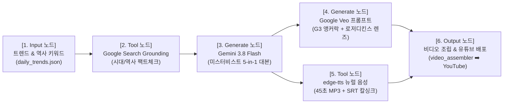

# 🌐 Google Opal(오팔) 호환 Hookverse 시네마틱 노드 설계서

> **개요**: Google Labs의 최신 노코드 비주얼 워크플로우 플랫폼 **Google Opal (`opal.google`)** 규격에 1:1로 대응하는 Hookverse Studio 5단계 자동화 노드 아키텍처입니다.

---

## 🧩 5대 핵심 노드 파이프라인 (Opal Visual Blueprint)

---

### [Node 1] Input: 실시간 트렌드 주입
- **역할**: 리서처의 `tools/trend_intelligence.py`가 수집한 일일 트렌드 중 1순위 키워드를 워크플로우 인풋으로 전달.
- **예시 인풋**: `1997년 IMF 자정의 조흥은행 지하 금고`

### [Node 2] Tool: Google Search Grounding (시대 고증 검증)
- **역할**: 대본 작성 전, 구글 검색 도구로 1997년 팩트체크:
  - 1997년 11월 당시 실존 은행명 확인 (조흥은행 O, 우리은행 X)
  - 당시 공중전화기 모델 (한국통신 버튼식 은색/주황색 전화기)
  - 서울 자정 날씨 및 타임스탬프

### [Node 3] Generate: Gemini 3.8 대본 생성 (작가)
- **역할**: `_company/_shared/거장_연출_및_후킹_바이블.md` 헌법 적용.
- **검증**: `tools/legal_guardrail.py` 자동 통과 (금기어 0%, 저작권 100% 안전).
- **산출물**: 성우가 읽을 수 있는 100% 순수 45초 한국어 나레이션 8씬.

### [Node 4] Generate: Google Veo / Gemini Omni 시네마틱 프롬프트 (디자이너)
- **역할**: 텍스트 대본을 영화급 영상 프롬프트로 변환.
- **규격**:
  - 캐릭터: `NEURA G3 MASTER FACE ANCHOR LOCK` (눈가/입가 매력점, 흑발 롱웨이브)
  - 광학 스펙: `35mm Anamorphic lens, Kodak Portra 400 tone, Roger Deakins lighting`
  - 카메라 모션: `Slow cinematic push-in, 1080x1920 vertical, 24fps`

### [Node 5] Tool: 성우 음성 & SRT 칼싱크 합성
- **역할**: `tools/generate_clean_audio.py`로 45초 고품질 MP3 및 1:1 싱크 SRT 자막 동시 생성.

### [Node 6] Output: 비디오 조립 & 유튜브 배포 (코다리 & PD)
- **역할**: 
  - `tools/video_assembler.py` 가변 싱크 엔진으로 8씬 영상 자동 렌더링.
  - Vrew 및 캡컷 템플릿 연동.
  - YouTube Data API v3로 채널 예약/업로드 완료!

---

*이 설계도는 `00_Raw/knowledge_packs/google_opal_hookverse_workflow.json`과 100% 동기화되어 에이전트들이 자동으로 참조합니다.*
